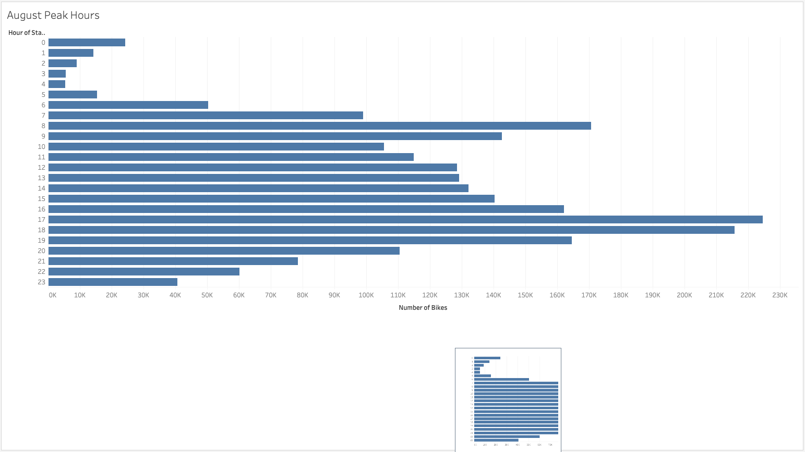
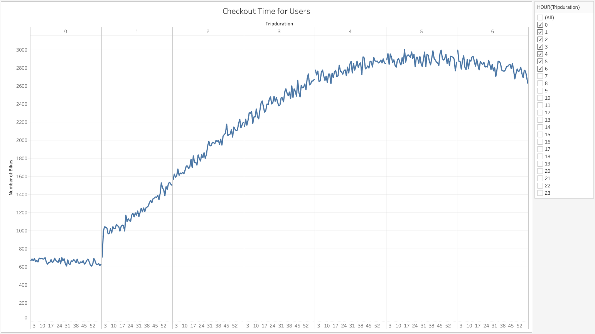
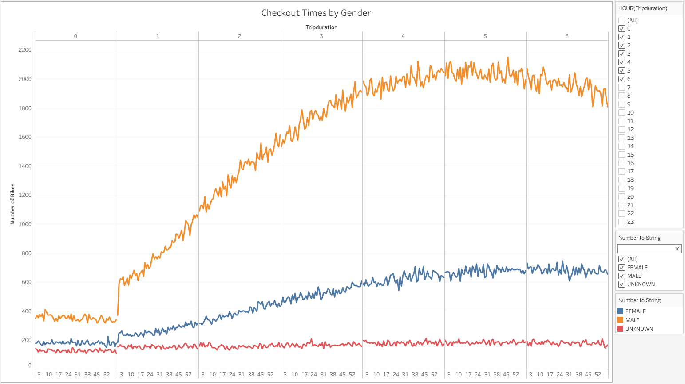
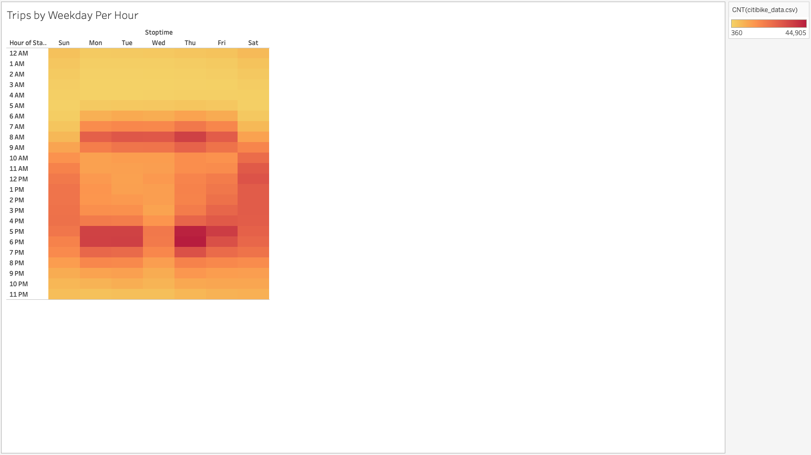
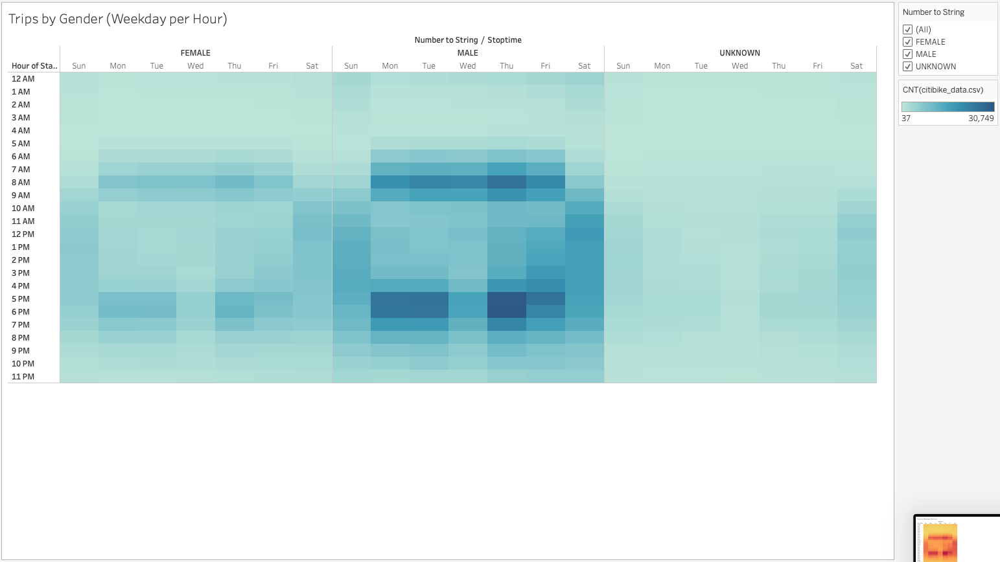
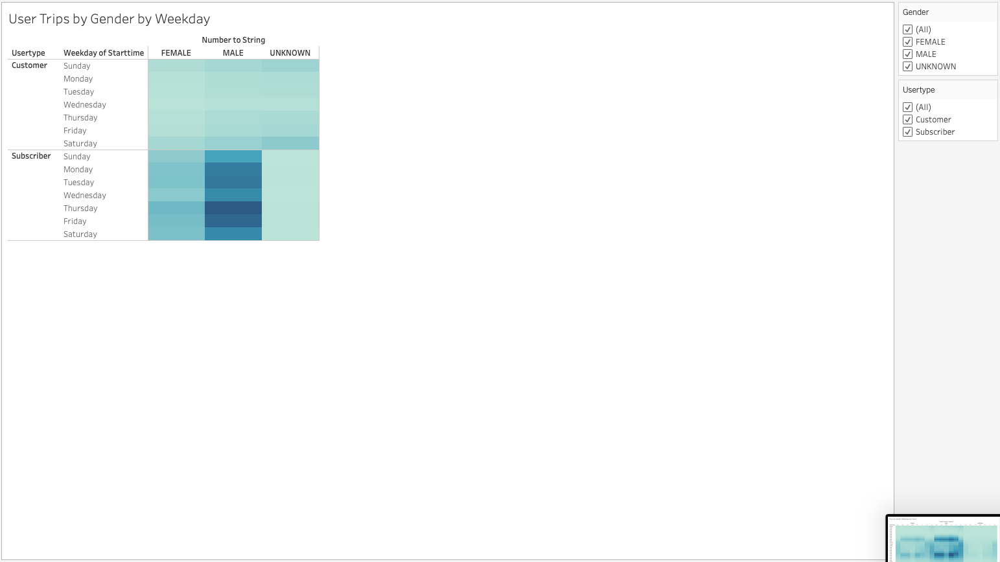
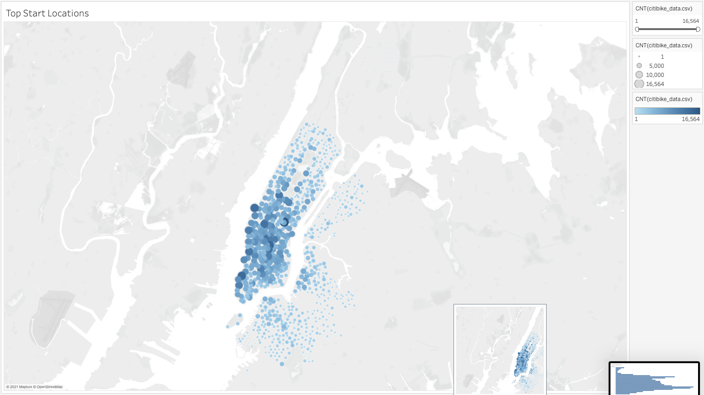
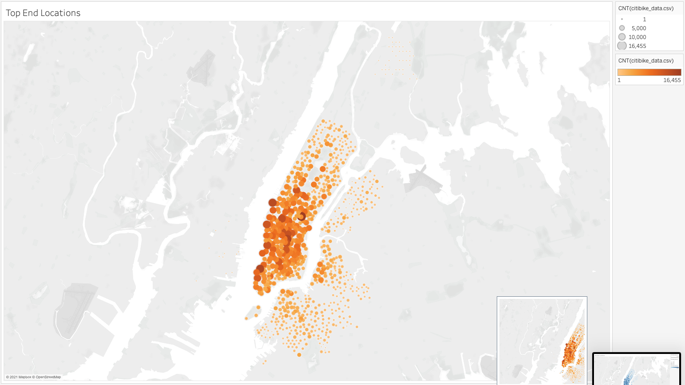
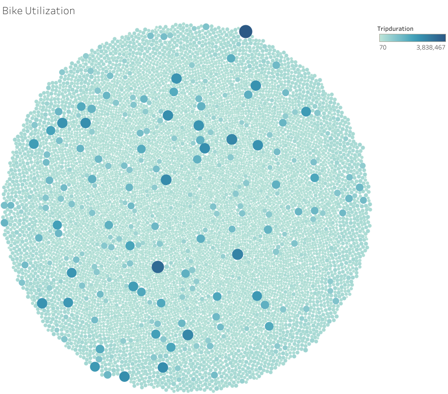

# Citibike Bikesharing Data & Visualizations

[Link to Citibike Data Dashboard](https://public.tableau.com/profile/eric2792#!/vizhome/CitibikeDataStory_16104945204870/CitiBikeData "Citibike Dashboard")

# In this project we took a raw CSV data file, read it into a Python notebook using Jupyter Notebooks. Read through and displayed the data as a data frame, edited column values based on their types. We then took the newly edited dataframe and exported it as a new CSV file to begin with our analysis and visualizations in Tableau.

Below you will find each image and a description:

This image shows the peak hours of the highest usage rates by the hour of the day.

This image shows the trip duration by the hour and minute of each day.

This image shows the trip duration as the image above but categorized by gender.

This image is a heatmap displaying the most popular times of trips by the weekday.

This image is a heatmap as the one above but categorized by gender.

This image shows the user trips by user type and gender per weekday.

This image shows the most popular trip starting points.

This image shows the most popular trip ending points.

This image shows the bike utilization by bike ID and size; and color to show the differences between trip duration.

## Summary
If I would create a better dashboard I would have to do so by making it more informative. I think a CEO or VP would like to know the pitch, the changes if any, the direction of the company and not much more. With that being said, I would like to work with data such as revenue and expenses for the company. What is coming and what is coming out to maintain a good standard of the Citibike Service.
## Technologies Used
- Pandas
- Jupyter Notebook
- Anaconda Navigator
- Zsh Terminal
- Tableau Public
- Visual Studio Code Editor
- Github
- Google Chrome